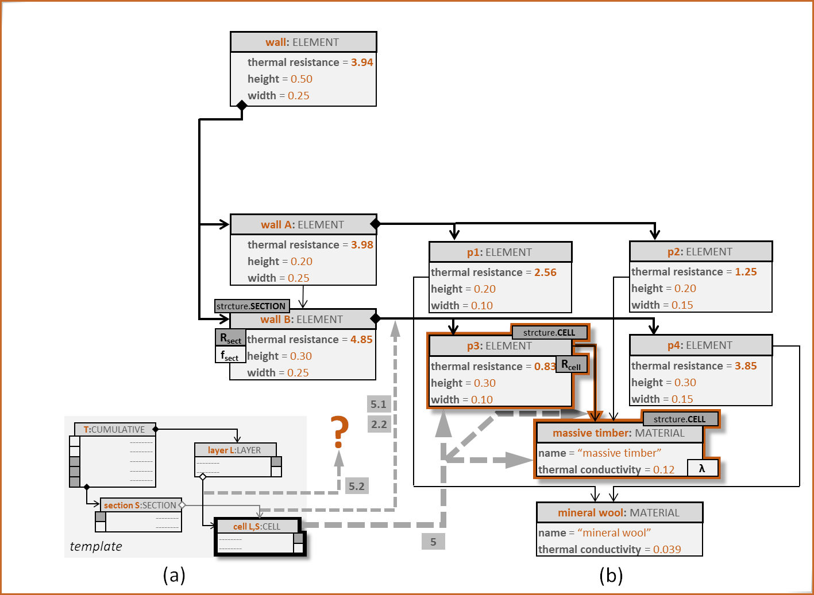
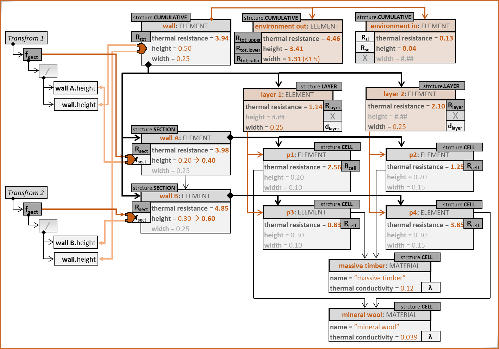
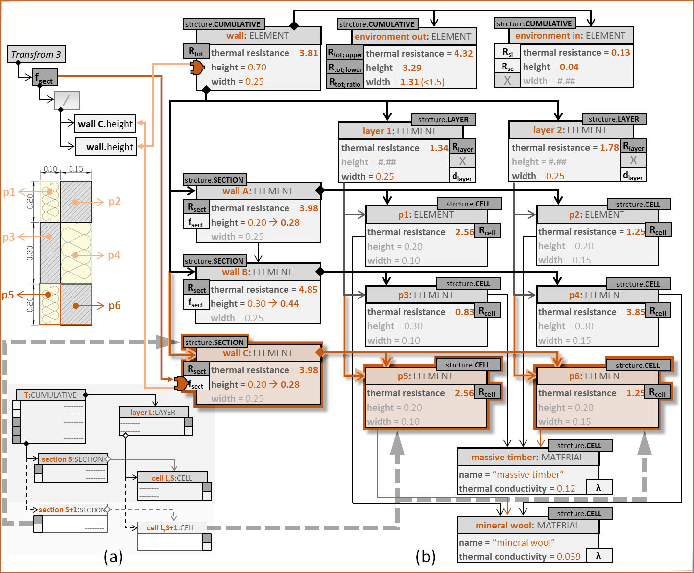

# Digital Guidelines
This document contains additional data supporting the Paper “Digitalising Guidelines: Requirement Definition and Compliance Enforcement in BIM Models”. The presented use cases demonstrate our method for the generation and application of digital guidelines in the AEC industry.

## Use Cases Based On the ISO 6946:2017, Section 6.7.2

It is to be noted that Section 6.7.2 describes a simplified method for the calculation of the total thermal resistance of a building component. This method is based on one typical part of the component, not on the entire component. For detailed calculations taking thermal bridges into account there is the ISO 10211. 

*Fig.1. Typical wall footprints: (a) massive timber with an insulation layer, (b) acoustically decoupled wall with armed concrete inner shell, timber outer shell, and mineral wool as thermal insulation and acoustic dampener.*

Fig.1 demonstrates the difference between the entire construction, e.g., wall, and a representative, or typical, part. For example, Fig.1(a) shows a 0.40m section of the wall that contains both a timber column and the insulation between two columns. This section represents the inhomogeneous layer with the correct ratio of materials, which is enough for the application of the guideline. Fig.1(b) shows a more complex construction with three inhomogeneous layers. The representative section here is larger, 1.00m long, since it requires all combinations of inhomogeneities to be accounted for.

*Fig.2. Wall decomposition: (b) in geometric profiles, (c) in cells according to ISO 6946:2017, Section 6.7.2.*

The next question is one of modelling. Fig.2 shows the different ways the wall from Fig.1(b) can be decomposed into model elements. The model in Fig.2(b) groups adjacent elements of the same material, while the model in Fig.2(c) decomposes the typical section in layers and sections in accordance with ISO 6946:2017, Section 6.7.2.2, Figure 1. Consequently, the two approaches produce models of vastly different sizes.

However, a model resulting from Fig.2(b) can be adapted to fulfil the requirements of the model resulting from Fig.2(c). We will demonstrate this by applying the template we presented in the referenced paper (see also Fig.3) to the following four use cases:
- **Use Case 1**: Very small generic data model, allowing significant modification. A step-by-step application.
- **Use Case 2**: Small generic data model, simple example, allowing modification.
- **Use Case 3**: Small generic data model, complex example, not suitable for modification.
- **Use Case 4**: IFC, simple example, allowing modification.

*Fig.3. The applicable templates as constructed in the accompanying paper.*

### Use Case 1: A Step By Step Application of ISO 6946:2017, Section 6.7.2

In this use case, we have chosen a very simple inhomogeneous construction, as shown in Fig.UC1.1(a). Each of the four parts, p1 to p4, is homogeneous in itself, consisting either of massive timber (the oblique hatch pattern) or of mineral wool. The data model (see Fig.UC1.1(b)) consists of only two types. Type ELEMENT allows containment or referencing between its instances. Each has its own thermal transmittance, height, and width. Type MATERIAL provides each instance of type ELEMENT with additional information, e.g., its design thermal conductivity.

*Fig.UC1.1. The initial situation: (a) the inhomogeneous wall and (b) the data model.*

In Fig.UC1.2 we see the instantiation of the data model in Fig.UC1.1(b). We have a hierarchical structure of elements, enabled by the containment relationship. At the top is instance **wall**, which consists of two parts, **wall A** and **wall B**. **Wall A** is comprised of parts **p1** and **p2**, while **wall B** – of parts **p3** and **p4**. Each part references an instance of type MATERIAL. For example, **p1** references **mineral wool**, and **p2** references **massive timber**. From the viewpoint of the architect, for example, this is enough information to describe the wall. However, if we want to prove that the thermal resistance of the entire construction has been calculated in accordance with ISO 6946, we need to apply the relevant template.

The application of the template involves:

- **Mappings**: between template elements and model elements.
- **Annotations**: labelling of attributes as template-specific values (e.g., λ) This includes re-purposing, such as annotating an attribute named **“height”** with a symbol signifying the *lower limit of the total thermal resistance of a construction*, due to the absence of such attributes from the original data model. This makes the attribute’s meaning *context-dependent*. From the viewpoint of the original data model in Fig.UC1.1(b), it still describes the height of an element, from the viewpoint of ISO 6946:2017, Section 6.7.2, it has a new calculation-specific meaning.
- **Instantiation**: generation of new model-specific instances in case there are not enough elements to satisfy the template’s requirements.

*Fig.UC1.2. The initial instantiation of the data model in Fig.3(b), consisting of two wall elements and four profile elements.*

We start by applying the SECTION template element to instances **wall A** and **wall B** in Fig.UC1.3. The template itself, with the relevant connections, is shown in Fig.UC1.3(a), while the adapted model is shown in Fig.UC1.3(b). We see that the adaptation includes only annotations: one for the instance **wall B** (as *structure.SECTION*), one for attribute **“thermal resistance”** (as *Rsect*), and one for attribute **“height”** (as *fsect*). The application model in Fig.UC1.9, however, includes multiple additional mappings (see entry 2 and its sub-entries). For example, the containment between **wall** and **wall B** is defined as the implementation of the relationship between template element CUMULATIVE and template element SECTION (thin dashed arrow marked as 2.1 in Fig.UC1.3(b)).

*Fig.UC1.3. Applying the SECTION template element to a single existing element.*

The next step of the template application is more complex, because it involves multiple elements of the existing model (see Fig.UC1.4). The template element CELL models homogeneous cells in the construction, which makes instances **p1** to **p4** excellent candidates. However, CELL also requires the presence of two attributes, the cell thermal resistance (*Rcell*) and the design thermal conductivity of the cell’s material (*λ*). In this model, however, those attributes reside in different instances. If we take **p3** as an example, it contains an attribute **“thermal resistance”**, but the attribute **“thermal conductivity”** resides in the instance **massive timber**, which **p3** references.

This results in the template element CELL being applied to *three elements*, **p3**, **massive timber**, and the *reference* between **p3** and **massive timber** simultaneously (see the thick dashed arrows amrked 5 in Fig.UC1.4, and entry 5 in Fig.UC1.9). As an aside, when template element CELL is applied to **p2**, which also references **massive timber**, the application will again include **massive timber**. The reason for this is that each individual template element application is a separate entry in the application model (compare entries 4 and 5 in Fig.UC1.9).

What is also of interest in this application are the relationships between the template elements. While the containment relationship between SECTION and CELL can be directly mapped to the containment relationship between **wall B** and **p3**, the relationship between LAYER and CELL cannot finds its counterpart yet (see entry 5.2 in Fig.UC1.9). This is something that will be added later, once we have handled template element LAYER.

*Fig.UC1.4. Applying the CELL template element to two existing elements.*

So far, we have applied the template elements SECTION and CELL, because the initial model contains elements that could be easily adapted. However, to perform the calculations according to ISO 6946, we also need to define layers. Since the initial model doesn’t contain any suitable elements, we will, for the first time, generate them. The data model in Fig.UC1.1(a) provides us with only two types. More suitable for our template is ELEMENT. Therefore, we instantiate it twice as **layer 1** and **layer 2**, and generate the necessary relationships, so that **wall** contains both **layer 1** and **layer 2**, while **layer 1** references **p1** and **p3**, and **layer 2** references **p2** and **p4**. The reason why, e.g., **layer 1** cannot contain **p1** is that it is already contained in **wall A**, and the data model forbids non-exclusive containment.

This process is described in entry 7 and its sub-entries in the application model in Fig.UC1.9. After generating and connecting the new instances we again annotate them according to the template requirements: for example, **layer 1** as *structure.LAYER*, its attribute **“thermal resistance”** as *Rlayer*, and attribute **“width”** as *dlayer*. We annotate attribute **“height”** with an *X*, or *not in use*, to avoid potential confusion.

During the application of the CELL template element, we noted that the relationship between LAYER and CELL could not be applied to the model due to the absence of instances annotated as LAYER (see also entry 5.2 in the application model in Fig.UC1.9). After the application of the LAYER template element, we can add the missing mapping (see the arrow from entry 7.3 to entry 5.2 in Fig.UC1.9), which completes the CELL template element application above.

*Fig.UC1.5. Applying the LAYER template element by creating new elements and attaching them to existing ones.*

Next in the template application is the CUMULATIVE element (see Fig.UC1.6). In the template itself, element CUMULATIVE is at the top of the hierarchy, containing both SECTION and LAYER elements. Therefore, the best candidate for it in the model is instance **wall**. In terms of relationships between the CUMULATIVE, SECTION, and LAYER elements, the mapping has already been performed during the application of SECTION and LAYER (e.g., see entries 2.1 and 7.1 in Fig.UC1.9). However, here we encounter another problem: too few attributes. The template requires annotations for at least five elements whereas **wall**, being an instance of type ELEMENT, offers only three attributes, two of which, **“height”** and **“width”** we cannot use. This makes the generation of new instances unavoidable. The result are two additional instances of type ELEMENT, **environment out** and **environment in**.

We map template element CUMULATIVE to five model elements simultaneously, the instance **wall**, the two newly generated instances, and the containment relationships between them (see highlighted elements in Fig.UC1.6). Further, we annotate **wall**, **environment out**, and **environment in**, as a group, with *structure.CUMULATIVE* (entry 9.1 in Fig.UC1.9). We annotate the attributes of **environment out** with some of the expected outputs of the ISO 6946 calculation, **“thermal resistance”** as *Rtot;upper*, **“height”** as *Rtot;lower*, and **“width”** as an optional control value, *Rtot;ratio*. For **environment in**, we annotate **“thermal resistance”** as input value *Rsi*, **“height”** as input value *Rse*, and **“width”** as *not in use*. 

*Fig.UC1.6. Applying the CUMULATIVE template element to an existing element and extending it by two further elements.*

Finally, to comply fully with ISO 6946:2017, Section 6.7.2, we need to perform a conversion. The reasoning is as follows. In the relevant calculations in the guideline, a layer’s width is considered with its measure unaltered (in this use case, in m), but a section’s height is considered as a *share* of the height of the entire construction under consideration. This is represented by the equation *Condition 1* in Fig.UC1.7. For example, for **wall A**, this means that attribute **“height”**, annotated as *fsect*, cannot be taken as it is, as 0.20m, but rather as the share of the height of **wall**, which is 0.50m. This requires a transformation from height in m to a unitless share measure (see equation *Transform 1* in Fig.UC1.7 and entry 10 in Fig.UC1.9) by means of dividing the height of **wall A** by the height of **wall**. The same conversion has to be performed for **wall B**. In this way **wall A's** height of 0.20 m is converted to a 0.40 share, and **wall B's** height of 0.30 m is converted to a 0.60 share of the entire construction.

*Fig.UC1.7. Adding a calculation to fulfil a condition attached to the SECTION template element.*

The final result of the model’s adaptation to the guideline is shown in Fig.UC1.8. It involves four instantiations of type ELEMENT, **layer 1**, **layer 2**, **environment out**, and **environment in**, including all relationships to already existing instances. In addition to that, all relevant instances and attributes have been annotated, and two conversion procedures have been defined.

*Fig.UC1.8. The final result of applying the template.*

*Fig.UC1.9. The template application model.*

*Fig.UC1.10. Updating the model after template application: adding a section automatically.*

*Fig.UC1.11. Updating the model after template application: adding an independent element.*

*Fig.UC1.12. The template application model: adding a section automatically.*

### Use Case 2: ISO 6946:2017, Section 6.7.2 applied to a Generic Data Model

The second use case involves the modelling of the wall presented in Fig.1(a). We have chosen a fairly generic data model that could represent the architect’s view. It is shown in the box in Fig.3(a). Abstract type *Element* can have *Data* attached to it.

*Fig.3. A generic data model (a) and one possible instantiation (b).*

*Fig.4. The adapted model.*

*Fig.5. The adapted model with full connectivity.*

### Use Case 2: ISO 6946:2017, Section 6.7.2 applied to an unsuitable model

*Fig.6. The wall construction (a), the corresponding data model (b) and one possible instantiation (c).*

*Fig.7. Model adaptation: step 1.*

*Fig.8. Model adaptation: step 2.*

### Use Case 3: ISO 6946:2017, Section 6.7.2 applied to an IFC Model

*Fig.9 An IFC wall with a layered structure.*

*Fig.10 An IFC wall with a profile structure.*

*Fig.11 An IFC wall adapted for calculating its thermal conductivity according to ISO 6946:2017, Section 6.7.2.*

