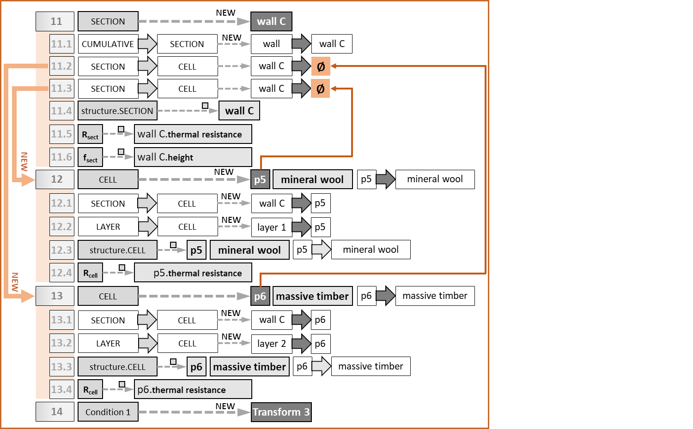
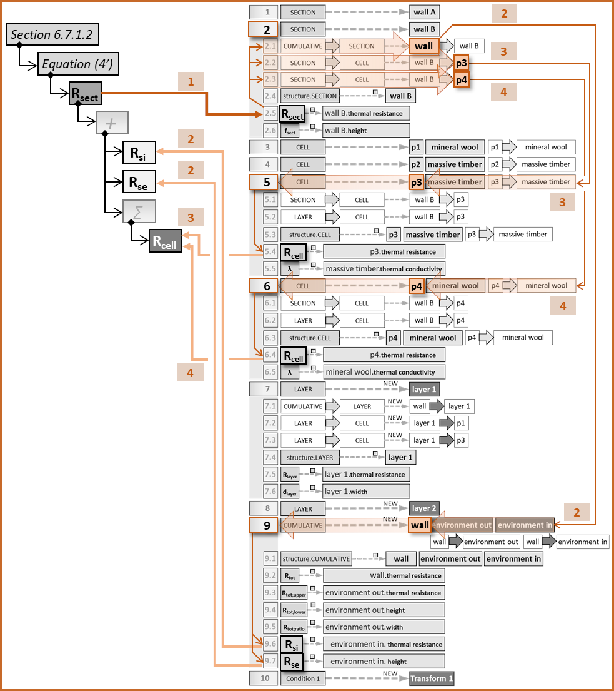
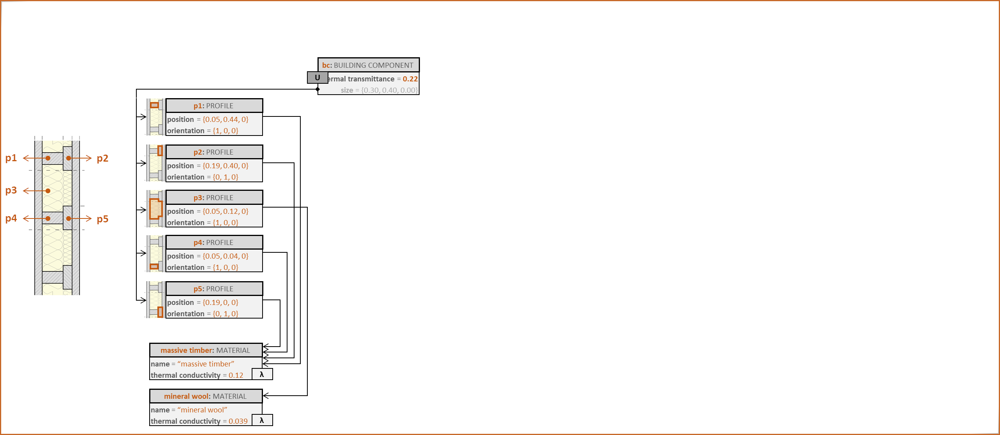

# Digital Guidelines
This document contains additional data supporting the Paper “Digitalising Guidelines: Requirement Definition and Compliance Enforcement in BIM Models”. The presented use cases demonstrate our method for the generation and application of digital guidelines in the AEC industry.

## Use Cases Based On the ISO 6946:2017, Section 6.7.2

It is to be noted that Section 6.7.2 describes a simplified method for the calculation of the total thermal resistance of a building component. This method is based on one typical part of the component, not on the entire component. For detailed calculations taking thermal bridges into account there is the ISO 10211. 

*Fig.1. Typical wall footprints: (a) massive timber with an insulation layer, (b) acoustically decoupled wall with armed concrete inner shell, timber outer shell, and mineral wool as thermal insulation and acoustic dampener.*

Fig.1 demonstrates the difference between the entire construction, e.g., wall, and a representative, or typical, part. For example, Fig.1(a) shows a 0.40m section of the wall that contains both a timber column and the insulation between two columns. This section represents the inhomogeneous layer with the correct ratio of materials, which is enough for the application of the guideline. Fig.1(b) shows a more complex construction with three inhomogeneous layers. The representative section here is larger, 1.00m long, since it requires all combinations of inhomogeneities to be accounted for.

*Fig.2. Wall decomposition: (a) in typical sections, (b) in geometric profiles, (c) in cells according to ISO 6946:2017, Section 6.7.2.*

The next question is one of modelling. Fig.2 shows the different ways the wall from Fig.1(b) can be decomposed into model elements. The model in Fig.2(b) groups adjacent elements of the same material, while the model in Fig.2(c) decomposes the typical section in layers and sections in accordance with ISO 6946:2017, Section 6.7.2.2, Figure 1. Consequently, the two approaches produce models of vastly different structure and size.

However, a model resulting from Fig.2(b) can be adapted to fulfil the requirements of the model resulting from Fig.2(c). We will demonstrate this by applying the template we presented in the referenced paper (see also Fig.3) to the following four use cases:
- **Use Case 1**: Very small generic data model, allowing significant modification. A step-by-step application.
- **Use Case 2**: Small generic data model, simple example, allowing modification.
- **Use Case 3**: Small generic data model, complex example, not suitable for modification.
- **Use Case 4**: IFC, simple example, allowing modification.

*Fig.3. The applicable template as constructed in the accompanying paper.*

The application of templates (see Fig.3) proceeds as follows:
- [x] Each template element is applied to a small representative part of the model **manually**.
- [x] An *application model* is built in the background **automatically**.
- [x] During model updates, the template is applied as needed **automatically** by utilizing the implicit rules supplied by the user during the manual step. Those rules reside in the application model.
- [x] During model updates, if there is a rule missing, the user will need to supply **additional manual input** so that the application model can be completed in the background.

The template depicted in Fig.3 contains the following elements:
- [x] **<ins>E01</ins>**: CUMULATIVE and its relationships (Fig.3(a)),
- [x] **<ins>E02</ins>**: SECTION and its relationships (Fig.3(a)),
- [x] **<ins>E03</ins>**: LAYER and its relationships (Fig.3(a)),
- [x] **<ins>E04</ins>**: CELL and its relationships (Fig.3(a)),
- [x] **<ins>E05</ins>**: adding / removing a LAYER  (Fig.3(b)),
- [x] **<ins>E06</ins>**: adding / removing a SECTION  (Fig.3(c)),
- [x] **<ins>E07</ins>**: adding / removing *both* a LAYER and a SECTION  (Fig.3(d)),
- [x] **<ins>E08</ins>**: calculating *Rcell* (Fig.3(a), also see equation (3) in ISO 6946:2017, Section 6.7.1.1),
- [x] **<ins>E09</ins>**: calculating *Rtot* (Fig.3(a), also see equation (5) in ISO 6946:2017, Section 6.7.2.2),
- [x] **<ins>E10</ins>**: calculating *Rsect* (Fig.3(b), the *thermal resistance of a section*, see reference to equation (4) and equation (6) in Section 6.7.2.3),
- [x] **<ins>E11</ins>**: calculating *Rlayer* (Fig.3(c), the *thermal resistance of a layer*, see equation (7) in Section 6.7.2.4),
- [x] **<ins>E12</ins>**: calculating *Rtot;lower* (Fig.3(d), the *lower limit of the total thermal resistance of the construction*, see equation (7) and reference to equation (4) in Section 6.7.2.4),
- [x] **<ins>E13</ins>**: calculating *Rtot;upper* (Fig.3(e), the *upper limit of the total thermal resistance of the construction*, see equation (6) in Section 6.7.2.3).

Not depicted in Fig.3 are:
- [ ] **E14**: the calculation of the error, *Rtot;ratio* according to Section 6.7.2.1, and
- [ ] **E15**: the condition that the fractional areas *fsect* of all sections should add up to 1 according to Section 6.7.2.2.

### Use Case 1: A Step-By-Step Application of ISO 6946:2017, Section 6.7.2

In this use case, we have chosen a very simple inhomogeneous construction, as shown in Fig.UC1.1(a). Each of the four parts, p1 to p4, is homogeneous in itself, consisting either of massive timber (the oblique hatch pattern) or of mineral wool. The data model (see Fig.UC1.1(b)) consists of only two types. Type ELEMENT allows containment or referencing between its instances. Each has its own thermal transmittance, height, and width. Type MATERIAL provides each instance of type ELEMENT with additional information, e.g., its design thermal conductivity.

*Fig.UC1.1. The initial situation: (a) the inhomogeneous wall and (b) the data model.*

In Fig.UC1.2 we see the instantiation of the data model in Fig.UC1.1(b). This instantiation happens automatically in the background of the application as the user models the wall via the graphic user interface (GUI). In this case, we have a hierarchical structure of elements, enabled by the containment relationship. At the top is instance **wall**, which consists of two parts, **wall A** and **wall B**. **Wall A** is comprised of parts **p1** and **p2**, while **wall B** – of parts **p3** and **p4**. Each part references an instance of type MATERIAL. For example, **p1** references **mineral wool**, and **p2** references **massive timber**. From the viewpoint of the architect, for example, this is enough information to describe the wall. However, if we want to prove that the thermal resistance of the entire construction has been calculated in accordance with ISO 6946, we need to apply the relevant template from Fig.3.

The application of the template, **manual** or **automatic**, involves:

- **Mappings**: between template elements and model elements,
- **Annotations**: labelling of attributes as template-specific values (e.g., λ) This includes re-purposing, such as annotating an attribute named **“height”** with a symbol signifying the *lower limit of the total thermal resistance of a construction*, due to the absence of such attributes from the original data model. This makes the attribute’s meaning *context-dependent*. From the viewpoint of the original data model in Fig.UC1.1(b), it still describes the height of an element, from the viewpoint of ISO 6946:2017, Section 6.7.2, it has a new calculation-specific meaning,
- **Instantiation**: generation of new model-specific instances in case there are not enough elements to satisfy the template’s requirements.

*Fig.UC1.2. The initial instantiation of the data model in Fig.UC1.1(b), consisting of two wall elements and four homogeneous parts.*

We start by applying the SECTION template element (**<ins>E02</ins>**) to instances **wall A** and **wall B** in Fig.UC1.3. The template elements, with the relevant connections, are shown in Fig.UC1.3(a), while the adapted model is shown in Fig.UC1.3(b). We see that, on surface level, the adaptation includes just annotations: one for the instance **wall B** (as *structure.SECTION*), one for attribute **“thermal resistance”** (as *Rsect*), and one for attribute **“height”** (as *fsect*). The application model in Fig.UC1.9, however, includes multiple additional mappings (see entry 2 and its sub-entries). For example, the containment between **wall** and **wall B** is defined as the implementation of the relationship between template element CUMULATIVE and template element SECTION (thin dashed arrow marked as 2.1 in Fig.UC1.3(b)). Similarly, the relationships between **wall B**, and parts **p3** and **p4** are handled as implementations of the relationship between SECTION and CELL.

*Fig.UC1.3. Applying the SECTION template element to a single existing element.*

The next step of the template application is more complex, because it involves multiple elements of the existing model (see Fig.UC1.4). The template element CELL (**<ins>E4</ins>**) models homogeneous cells in the construction, which makes instances **p1** to **p4** excellent candidates. However, CELL also requires the presence of two attributes, the cell thermal resistance (*Rcell*) and the design thermal conductivity of the cell’s material (*λ*). In this model, however, those attributes reside in different instances. If we take **p3** as an example, it contains an attribute **“thermal resistance”**, but the attribute **“thermal conductivity”** resides in the instance **massive timber**, which **p3** references.

This results in the template element CELL being applied to *three elements*, **p3**, **massive timber**, and the *reference* between **p3** and **massive timber** simultaneously (see the thick dashed arrows amrked 5 in Fig.UC1.4, and entry 5 in Fig.UC1.9). As an aside, when template element CELL is applied to **p2**, which also references **massive timber**, the application will again include **massive timber**. The reason for this is that each individual template element application is a separate entry in the application model (compare entries 4 and 5 in Fig.UC1.9).

What is also of interest in this application are the relationships between the template elements. While the containment relationship between SECTION and CELL can be directly mapped to the containment relationship between **wall B** and **p3**, the relationship between LAYER and CELL cannot finds its counterpart yet (see entry 5.2 in Fig.UC1.9). This is something that will be added later, once we have handled template element LAYER (**<ins>E3</ins>**).

*Fig.UC1.4. Applying the CELL template element to two existing elements.*

So far, we have applied the template elements SECTION and CELL, because the initial model contains elements that could be easily adapted. However, to perform the calculations according to ISO 6946, we also need to define layers (**<ins>E3</ins>**). Since the initial model doesn’t contain any suitable elements, we will, for the first time, generate them. The data model in Fig.UC1.1(a) provides us with only two types. More suitable for our template is ELEMENT. Therefore, we instantiate it twice as **layer 1** and **layer 2**, and generate the necessary relationships, so that **wall** contains both **layer 1** and **layer 2**, while **layer 1** references **p1** and **p3**, and **layer 2** references **p2** and **p4**. The reason why, e.g., **layer 1** cannot contain **p1** is that it is already contained in **wall A**, and the data model forbids non-exclusive containment.

This process is formalised in entry 7 and its sub-entries in the application model in Fig.UC1.9. After generating and connecting the new instances we again annotate them according to the template requirements: for example, **layer 1** as *structure.LAYER*, its attribute **“thermal resistance”** as *Rlayer*, and attribute **“width”** as *dlayer*. We annotate attribute **“height”** with an *X*, or *not in use*, to avoid potential confusion.

During the application of the CELL template element, we noted that the relationship between LAYER and CELL could not be applied to the model due to the absence of instances annotated as LAYER (see also entry 5.2 in the application model in Fig.UC1.9). After the application of the LAYER template element, we can add the missing mapping (see the arrow from entry 7.3 to entry 5.2 in Fig.UC1.9), which completes the CELL template element application above.

*Fig.UC1.5. Applying the LAYER template element by creating new elements and attaching them to existing ones.*

Next in the template application is the CUMULATIVE element (**<ins>E1</ins>**, see Fig.UC1.6). In the template itself, element CUMULATIVE is at the top of the hierarchy, containing both SECTION and LAYER elements. Therefore, the best candidate for it in the model is instance **wall**. In terms of relationships between the CUMULATIVE, SECTION, and LAYER elements, the mapping has already been performed during the application of SECTION and LAYER (e.g., see entries 2.1 and 7.1 in Fig.UC1.9). However, here we encounter another problem: too few attributes. The template requires annotations for at least five variables whereas **wall**, being an instance of type ELEMENT, offers only three attributes, two of which, **“height”** and **“width”** we cannot use since they have other functions. This makes the generation of new instances unavoidable. The result are two additional instances of type ELEMENT, **environment out** and **environment in**.

This necessitates the mapping of template element CUMULATIVE to five model elements simultaneously, the instance **wall**, the two newly generated instances, and the containment relationships between them (see highlighted elements in Fig.UC1.6). Further, we annotate **wall**, **environment out**, and **environment in**, as a group, with *structure.CUMULATIVE* (entry 9.1 in Fig.UC1.9). We annotate the attributes of **environment out** with some of the expected outputs of the ISO 6946 calculation, **“thermal resistance”** as *Rtot;upper*, **“height”** as *Rtot;lower*, and **“width”** as an optional control value, *Rtot;ratio*. For **environment in**, we annotate **“thermal resistance”** as input value *Rsi*, **“height”** as input value *Rse*, and **“width”** as *not in use*. 

*Fig.UC1.6. Applying the CUMULATIVE template element to an existing element and extending it by two further elements.*

Finally, to comply fully with ISO 6946:2017, Section 6.7.2, we need to perform a conversion. The reasoning is as follows. In the relevant calculations in the guideline, a layer’s width is considered with its measure unaltered (in this use case, in m), but a section’s height is considered as a *share* of the height of the entire construction under consideration. This is represented by the equation *Condition 1* in Fig.UC1.7 (see also template element **E15**). For example, for **wall A**, this means that attribute **“height”**, annotated as *fsect*, cannot be taken as it is, as 0.20m, but rather as the share of the height of **wall**, which is 0.50m. This requires a transformation from height in m to a unitless share measure (see equation *Transform 1* in Fig.UC1.7 and entry 10 in Fig.UC1.9) by means of dividing the height of **wall A** by the height of **wall**. The same conversion has to be performed for **wall B**. In this way **wall A's** height of 0.20 m is converted to a 0.40 share, and **wall B's** height of 0.30 m is converted to a 0.60 share of the entire construction.

*Fig.UC1.7. Adding a calculation to fulfil a condition attached to the SECTION template element.*

The final result of the model’s adaptation to the guideline is shown in Fig.UC1.8. It involves four instantiations of type ELEMENT, **layer 1**, **layer 2**, **environment out**, and **environment in**, including all relationships to already existing instances. In addition to that, all relevant instances and attributes have been annotated, and two conversion procedures have been defined.

*Fig.UC1.8. The final result of applying the template.*

*Fig.UC1.9. The template application model.*

After completing the manual application of template elements, accompanied by the automatic generation of the model application model in Fig.UC1.9, we have reached the phase of **automatic updating**. Let us assume that the user edits the model by adding complexity to the wall. Now that we have applied the template to the model, this editing step can be performed in two different ways. First, if the user wishes to include another portion of the wall in the calculation of the wall’s total thermal resistance, template element **<ins>E06</ins>** can be used to add another SECTION. In Fig.UC1.10 the relevant template element is in (a) and the automatically updated model, with the new instances highlighted, is in (b). Second, if the user only wishes to add another part to the wall without affecting the calculation, the new instance can be added without the involvement of the template (see Fig.UC1.11). This choice can be implemented via the GUI of the authoring software.

*Fig.UC1.10. Updating the model after template application: adding a section automatically.*

In both cases we end up with a new instance **wall C**. However, in the first case, with the involvement of the template application model, the system automatically “knows” that a section in this context requires two cells, and that each cell is also contained in a separate layer (see the logic flow indicated by the arrows in Fig.UC1.12). ). This leads to the automatic generation of new instances and the relationships between them, and the automatic mapping and annotation of those by the relevant template elements.

*Fig.UC1.11. Updating the model after template application: adding an element independent from the template.*

*Fig.UC1.12. The template application model: adding a section automatically.*

When listing all separate template elements we mentioned quite a few calculations (e.g., **<ins>E08</ins>** to **E15**), but have not addressed them in any of the steps we just described. The reason for this is that the mappings and annotations recorded in our application model, together with the internal template mappings depicted in Fig.3, are sufficient to define the input and output of each individual call of any of those calculations completely automatically, without any further input from the user.

For example, let us examine **<ins>E8</ins>**, the calculation of *Rsect*, the thermal resistance of a section, in **wall B**. The formalisation of this calculation from the relevant equation in ISO 6946 is discussed at length in the paper. As input, this calculation requires the thermal resistance *Rcell* of all cells contained in the section, in this case **p3** and **p4**, and the internal and external surface resistance, *Rsi* and *Rse*, respectively. 

*Fig.UC1.13. Calling the calculation of the thermal resistance of a section via the template application model.*

The logical chain starts with the output, *Rsect*, in instance **wall B** (annotated as 1 in Fig.UC1.13). From there, we look for the corresponding CUMULATIVE element, in this case **wall**, which by template definition contains *Rsi* and *Rse* (follow the arrows annotated as 2 in Fig.UC1.13). Once *Rsi* and *Rse* have been located in instance **wall**, they can be fed as input into the equation.

Next, in order to locate the thermal resistance *Rcell* of each cell contained in **wall B**, we follow all implementations of the relationship between SECTION and CELL (annotated as 3 and 4 in Fig.UC1.13). Those lead us to instances **p3** and **p4**, where we locate the attribute with the relevant annotation, i.e., **"thermal resistance"**, and feed its value as input into the equation.

In this way, *any* equation linked to the template can be called multiple times for multiple elements (e.g., **wall A**, **wall B**, and **wall C**) with the correct input without the need for the current user or the person performing the initial manual mapping to know *any* of the calculation logic or to interact with it in any way.

### Use Case 2: ISO 6946:2017, Section 6.7.2 applied to a Generic Data Model

The second use case involves the modelling of the wall presented in Fig.1(a). We have chosen a fairly generic data model that could represent the architect’s view. It is shown in the box in Fig.3(a). Abstract type *ELEMENT* can have *DATA* attached to it.

In spite of having more types that Use Case 1, this data model is actually more restrictive. For example, if we want to add cells and sections to a structure consisting only of layers, we can either have a layer as the parent container of a cell (as shown in Fig.UC2.2), or a section as a parent container of the cell, but not both. This is due to the rigid data model that allows only instances of *BUILDING COMPONENT* to contain instances of *LAYER*. Type *DATA* offers an additional hierarchy level below *LAYER*, which enables us to apply template element CELL (**<ins>E4</ins>**). However, all containment relationships are *exclusive*, i.e., no two instances of any of the subtypes of *ELEMENT* (see the abstract root of the inheritance tree in Fig.UC2.1(a)) can contain the same instance of type *DATA*.

*Fig.UC2.1. A generic data model (a) and one possible instantiation (b).*

Fig.UC2.2 demonstrates our initial attempt to apply the template by generating a new instance of type *DATA* for each application of template elements CELL and SECTION. One single application of CELL results in a mapping in the application model between CELL and *six* model elements (labelled as 1 in the figure): **iso6946 cell 3b**, **layer 3**, the reference from **layer 3** to **iso6946 cell 3b**, the reference from **layer 3** to **la3**, **la3**, and the reference from **la3** to **massive timber**. Such complexity can be an indicator of the unsuitability of the template to the model. However, as long as the mapping is possible, the template is still applicable.

*Fig.UC2.2. The adapted model.*

The next step is the mapping of the containment relationship between LAYER and CELL (marked as 1.1). This is straightforward because it is part of the model elements we generated. Yet the relationship between SECTION and CELL (marked as 1.2 and a question mark) cannot be mapped because the model does not allow non-exclusive containment. For this reason, we employ the annotation mechanism as a work-around. First, we enable the annotation not just of attribute slots, but of individual indices if the slot type is an ordered collection (attribute **"values"** in type *DATA* has the type <code>array of doubles</code>). Second, we define two special annotation symbols, <code>◊</code>, and <code>→</code>, to indicate the owner and target of the relationship, respectively. In this way, for example, instance **section b** can declare its relationship with instances **cell 1b**, **cell 2b**, and **cell 3b** via annotations only (see Fig.UC2.3).

If we look closer, slot **“values”** in **section b** contains five doubles, the first annotated as *Rsect*, the second as *fsect*, as required by template element SECTION, and the last three as <code>◊</code>. These are the ordered ids of the cells contained in **section b**. The same slot **“values”** in **cell 3b**, e.g., contains two doubles. The first is annotated as *Rcell*, as required by template element CELL, the second as <code>→</code>, marking it as a target, or id, for referencing. Since slot **“values”** in **section b** contains 203.0 annotated as <code>◊</code>, and slot **“values”** in **cell 3b** contains 203.0 annotated as <code>→</code>, the relationship we need can be established by simple equality of doubles.

*Fig.UC2.3. The adapted model with full connectivity.*

Looking at the adapted model in Fig.UC2.3 we see a near doubling of the model elements. Such situations indicate a poor match between template and model. Of course, in this particular case, the template is not applied across the entire model, just to those parts relevant for ISO 6946. Nevertheless, the cumulative effect of applying multiple templates to an ill-suited model can be a significant size increase.

### Use Case 3: ISO 6946:2017, Section 6.7.2 applied to an unsuitable model

This use case is even more ill-suited to our template than the previous one. The reason is not the data model itself, rather, it is the instantiation, which reflects the users’ understanding of the modelling task.

Fig.UC3.1 shows a horizontal section through the modelled wall. The initial model decomposes the wall into profiles **p1** to **p5** (see Fig.UC3.1(b)) that are homogeneous in terms of material and play different roles in the wall’s structure. Additionally, the outermost layers of the wall are not included in the model at all. We cannot describe this model as “wrong” since its purpose is not known to us. We could say that it has some unexpected features. The reason for this becomes clear when we consider what portion of the wall needs to be modelled for a calculation of the thermal transmittance according to ISO 6946 (see Fig.UC3.1(c)). The decomposition we would need is so different from the one in the initial model that we could describe it as incompatible (compare Fig.UC3.1(b) and (d)).

*Fig.UC3.1. Wall decomposition: (a) modelling the the inhomogeneous layer, (b) modelling the profiles in the inhomogeneous layer, (c) a typical section, (d) modelling the structure for ISO 6946 for the typical section.*

Fig.UC3.2 shows the initial model consisting of one instance of *BUILDING COMPONENT*, five instances of *PROFILE*, and two instances of *MATERIAL* (Fig.UC3.2(c)).

*Fig.UC3.2. The wall construction (a), the corresponding data model (b) and one possible instantiation (c).*

The template application in this case doesn’t need to force two contradictory decompositions together. Instead, we opted for defining a parallel instantiation linked to the original elements of the model to indicate overlap. Fig.UC3.3 and Fig.UC3.4 demonstrate this. To the initial 8 instances we added 4 *DATA* instances for the layers, 4 for the sections, and 16 for the cells. While this produces a model that is 375% the size of the original, it need not always be the case. The original modelled a very small portion of the wall. In reality, such walls can easily contain upwards of 20 structural profiles alone, while the portion modelled for the calculation of the thermal resistance remains the same, because it is only *representative of the wall*, not a *model of the entire wall*. This means that in real world situations the resulting model can vary between 150% and 200% the size of the original.

*Fig.UC3.3. Model adaptation: step 1.*

*Fig.UC3.4. Model adaptation: step 2.*

However, this is not the only challenge we face. After the adaptation we have two separate models of the same portion of the wall which have to be kept synchronized through all subsequent model updates. This necessitates the establishment of additional relationships in the model, as shown in Fig.UC3.4. For example, instance **p3** (representing the insulation) needs to reference four cells, **2a**, **2b**, **2d**, and **3a**, while instance **p4** needs to reference cell **2c**, and instance **p5** needs to reference three cells, **3b**, **3c**, and **3d**. In addition, the application model has to contain rules for adapting to size and material changes, as well as for the deletion of addition of new *PROFILE* instances.

In conclusion, we still managed to apply the template, even to a model as ill-suited as this, but had to duplicate a part of the model. This is resorting to the strategy many BIM users employ when faced with the multiple requirements on digital modelling in different domains, *something we set out to avoid*. In is no exaggeration to say that repeating this strategy for multiple guidelines could quickly descend into chaos.

### Use Case 4: ISO 6946:2017, Section 6.7.2 applied to an IFC Model

For the final use case we chose the Industry Foundation Classes (IFC) standard. Since IFC offers the entity *IfcMaterialLayer* it might be tempting to employ it to build a layered construction. However, inhomogeneity in a layer cannot be represented due to the admissible multiplicity of the relationship between *IfcMaterialLayer* and *IfcMaterial* (see Fig.UC4.1).

*Fig.UC4.1. An IFC wall with a layered structure.*

An inhomogeneous layer can be represented only by a collection of *IfcMaterialProfile* instances, as shown in Fig.UC4.2. Here, profiles with arbitrarily complex geometry, but homogeneous in terms of material, can be declared as part of a *IfcMaterialProfileSet*, which can be assigned to a wall, e.g., via the relationship *IfcRelAssociatesMaterial* and the entity *IfcMaterialProfileSetUsage*. However, IFC does not allow for ordering or for referencing of neighboring profiles.

*Fig.UC4.2. An IFC wall with a profile structure.*

*IfcMaterialProfileSet* and *IfcMaterialProfile* instances cannot build the necessary data structure for the application of template elements like LAYER or SECTION either. On the other hand, IFC offers a very flexible generic way of modelling via placeholders, such as entity *IfcBuildingElementProxy*, and custom property sets (in Fig.UC4.3 property set instances have a type with the prefix PSET_, e.g., **1a**:PSET_C_CELL). 

*Fig.UC4.3. An IFC wall adapted for calculating its thermal conductivity according to ISO 6946:2017, Section 6.7.2.*

