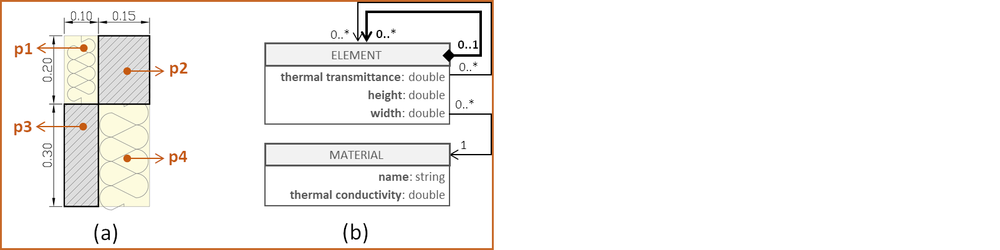
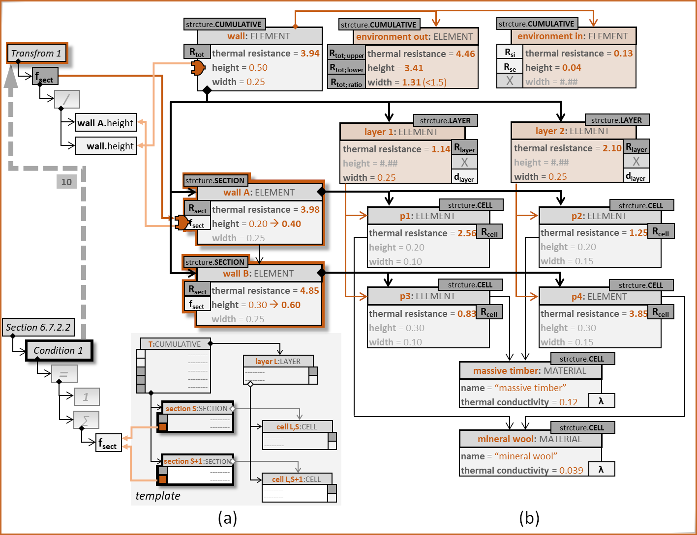

# Digital Guidelines
This document contains additional data supporting the Paper “Digitalising Guidelines: Requirement Definition and Compliance Enforcement in BIM Models”. The presented use cases demonstrate our method for the generation and application of digital guidelines in the AEC industry.

## Use Cases Based On the ISO 6946:2017, Section 6.7.2

It is to be noted that Section 6.7.2 describes a simplified method for the calculation of the total thermal resistance of a building component. This method is based on one typical part of the component, not on the entire component. For detailed calculations taking thermal bridges into account there is the ISO 10211. 

*Fig.1. Typical wall footprints: (a) massive timber with an insulation layer, (b) acoustically decoupled wall with armed concrete inner shell, timber outer shell, and mineral wool as thermal insulation and acoustic dampener.*

Fig.1 demonstrates the difference between the entire construction, e.g., wall, and a representative, or typical, part. For example, Fig.1(a) shows a 0.40m section of the wall that contains both a timber column and the insulation between two columns. This section represents the inhomogeneous layer with the correct ratio of materials, which is enough for the application of the guideline. Fig.1(b) shows a more complex construction with three inhomogeneous layers. The representative section here is larger, 1.00m long, since it requires all combinations of inhomogeneities to be accounted for.

*Fig.2. Wall decomposition: (b) in geometric profiles, (c) in cells according to ISO 6946:2017, Section 6.7.2.*

The next question is one of modelling. Fig.2 shows the different ways the wall from Fig.1(b) can be decomposed into model elements. The model in Fig.2(b) groups adjacent elements of the same material, while the model in Fig.2(c) decomposes the typical section in layers and sections in accordance with ISO 6946:2017, Section 6.7.2.2, Figure 1. Consequently, the two approaches produce models of vastly different sizes.

However, a model resulting from Fig.2(b) can be adapted to fulfil the requirements of the model resulting from Fig.2(c). We will demonstrate this by applying the template we presented in the referenced paper (see also Fig.3) to the following four use cases:
- **Use Case 1**: Very small generic data model, allowing significant modification. A step-by-step application.
- **Use Case 2**: Small generic data model, simple example, allowing modification.
- **Use Case 3**: Small generic data model, complex example, not suitable for modification.
- **Use Case 4**: IFC, simple example, allowing modification.

*Fig.3. The applicable templates as constructed in the accompanying paper.*

### Use Case 1: A Step By Step Application of ISO 6946:2017, Section 6.7.2

In this use case, we have chosen a very simple inhomogeneous construction, as shown in Fig.UC1.1(a). Each of the four parts, p1 to p4, is homogeneous in itself, consisting either of massive timber (the oblique hatch pattern) or of mineral wool. The data model (see Fig.UC1.1(b)) consists of only two types. Type ELEMENT allows containment or referencing between its instances. Each has its own thermal transmittance, height, and width. Type MATERIAL provides each instance of type ELEMENT with additional information, e.g., its design thermal conductivity.

*Fig.UC1.1. The initial situation: (a) the inhomogeneous wall and (b) the data model.*

In Fig.UC1.2 we see the instantiation of the data model in Fig.UC1.1(b). We have a hierarchical structure of elements, enabled by the containment relationship. At the top is instance **wall**, which consists of two parts, **wall A** and **wall B**. **Wall A** is comprised of parts **p1** and **p2**, while **wall B** – of parts **p3** and **p4**. Each part references an instance of type MATERIAL. For example, **p1** references **mineral wool**, and **p2** references **massive timber**. From the viewpoint of the architect, for example, this is enough information to describe the wall. However, if we want to prove that the thermal resistance of the entire construction has been calculated in accordance with ISO6946, we need to apply the relevant templates.

*Fig.UC1.2. The initial instantiation of the data model in Fig.3(b), consisting of two wall elements and four profile elements.*

We start by applying the SECTION template to instances **wall A** and **wall B** in Fig.UC1.3. The template itself, with the relevant connections, is shown in Fig.UC1.3(a), while the adapted model is shown in Fig.UC1.3(b). We see that the adaptation includes only annotations: one for the instance **wall B** (as *structure.SECTION*), one for attribute **“thermal resistance”** (as *Rsect*), and one for attribute **“height”** (as *fsect*).

*Fig.UC1.3. Applying the SECTION template to a single existing element.*

*Fig.UC1.4. Applying the CELL template to two existing elements.*

*Fig.UC1.5. Applying the LAYER template by creating new elements and attaching them to existing ones.*

*Fig.UC1.6. Applying the CUMULATIVE template to an existing element and extending it by two further elements.*

*Fig.UC1.7. Adding a calculation to fulfil a condition attached to the SECTION template.*

*Fig.UC1.8. The final result of applying the template.*

### Use Case 2: ISO 6946:2017, Section 6.7.2 applied to a Generic Data Model

The second use case involves the modelling of the wall presented in Fig.1(a). We have chosen a fairly generic data model that could represent the architect’s view. It is shown in the box in Fig.3(a). Abstract type *Element* can have *Data* attached to it.

*Fig.3. A generic data model (a) and one possible instantiation (b).*

*Fig.4. The adapted model.*

*Fig.5. The adapted model with full connectivity.*

### Use Case 2: ISO 6946:2017, Section 6.7.2 applied to an unsuitable model

*Fig.6. The wall construction (a), the corresponding data model (b) and one possible instantiation (c).*

*Fig.7. Model adaptation: step 1.*

*Fig.8. Model adaptation: step 2.*

### Use Case 3: ISO 6946:2017, Section 6.7.2 applied to an IFC Model

*Fig.9 An IFC wall with a layered structure.*

*Fig.10 An IFC wall with a profile structure.*

*Fig.11 An IFC wall adapted for calculating its thermal conductivity according to ISO 6946:2017, Section 6.7.2.*

